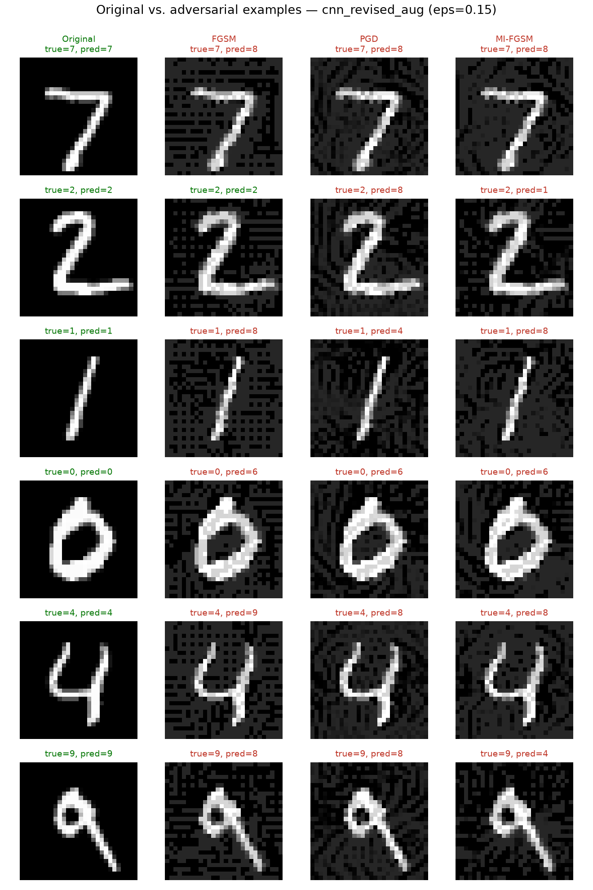

# ai-hw-summer-2026-aa

Adversarial attacks on frozen, already-trained MNIST digit classifiers, fooling models that were trained in [ai-hw-summer-2026-nn](https://github.com/byy9512/ai-hw-summer-2026-nn), and measuring how well each one holds up.

The task here is to craft adversarial perturbations against target models and evaluate.

## Data

[MNIST](https://docs.pytorch.org/vision/stable/generated/torchvision.datasets.MNIST.html) via `torchvision.datasets.MNIST` (mirrors [huggingface.co/datasets/ylecun/mnist](https://huggingface.co/datasets/ylecun/mnist)). Attacks are crafted and evaluated on the **test split only** — the models being attacked were trained on the train split in the prior project.

## Target models

Frozen models from previous assignment: **MLP, CNN, Transformer**, each with a **Revised** variant (BatchNorm/extra layer/mean-pooling — see the `-nn` repo for details), each trained **with and without image augmentation** — 3 architectures × 2 variants × 2 training modes = 12 models.

## Attacks

All three attacks are implemented in [`attacks.py`](attacks.py), operating directly in raw `[0, 1]` pixel space (the target model is wrapped in `NormalizedModel`, which applies MNIST normalization internally, so perturbation budgets and clipping are meaningful in actual pixel units).

- **FGSM** (Goodfellow et al., 2015) — single step in the sign direction of the loss gradient: `x_adv = x + ε · sign(∇ₓ loss)`
- **I-FGSM / PGD** (Kurakin et al., 2017 / Madry et al., 2018) — the same idea repeated for 40 iterations with step size α=0.01, projecting back into the ε-ball after each step. PGD is identical except it starts from a random point inside the ε-ball rather than at the original image.
- **MI-FGSM** (Dong et al., 2018) — same iterative loop as I-FGSM, but accumulates an L1-normalized momentum term over the gradient direction before each step. Uses the same α and iteration count as I-FGSM/PGD, so momentum is the only variable being tested against it.

Epsilon (L∞ perturbation budget, in raw pixel units) is swept across **0.05, 0.1, 0.15, 0.2, 0.25, 0.3** for every attack.

## Metrics

- **Recognition rate before attacks** — the target model's test accuracy with no perturbation applied
- **Attack success rate (ASR)** — of the test images the model originally classified *correctly*, the percentage the attack flips to an incorrect prediction. Images the model already got wrong are excluded from the denominator, since fooling an already-wrong prediction isn't a meaningful attack success.

## Results

Full results for all 12 models × 4 attacks × 6 epsilons are in [`results.json`](results.json), produced by [`run_sweep.py`](run_sweep.py).

### Recognition rate (before attacks)

| Model | Recognition Rate |
|---|---|
| MLP | 97.92% |
| MLP (Aug) | 97.76% |
| MLP Revised | 98.35% |
| MLP Revised (Aug) | 98.47% |
| CNN | 99.14% |
| CNN (Aug) | 99.42% |
| CNN Revised | 99.15% |
| CNN Revised (Aug) | 99.44% |
| Transformer | 98.32% |
| Transformer (Aug) | 98.72% |
| Transformer Revised | 98.25% |
| Transformer Revised (Aug) | 98.43% |

### FGSM — Attack Success Rate

| Model | ε=0.05 | ε=0.1 | ε=0.15 | ε=0.2 | ε=0.25 | ε=0.3 |
|---|---|---|---|---|---|---|
| MLP | 16.8% | 55.6% | 78.4% | 87.9% | 93.2% | 96.3% |
| MLP (Aug) | 19.3% | 65.5% | 87.2% | 93.7% | 95.7% | 96.6% |
| MLP Revised | 33.7% | 82.9% | 95.8% | 98.8% | 99.5% | 99.8% |
| MLP Revised (Aug) | 28.0% | 75.4% | 90.7% | 96.3% | 98.2% | 99.1% |
| CNN | 4.0% | 15.0% | 27.4% | 43.5% | 59.7% | 71.4% |
| CNN (Aug) | 4.3% | 25.3% | 65.3% | 83.2% | 87.5% | 88.5% |
| CNN Revised | 5.0% | 19.7% | 39.4% | 57.8% | 69.6% | 78.0% |
| CNN Revised (Aug) | 8.2% | 43.9% | 70.3% | 82.5% | 87.2% | 89.0% |
| Transformer | 15.7% | 54.9% | 80.2% | 90.1% | 93.4% | 94.6% |
| Transformer (Aug) | 15.9% | 58.0% | 79.1% | 88.1% | 91.9% | 93.7% |
| Transformer Revised | 16.4% | 49.9% | 73.6% | 85.8% | 91.5% | 93.4% |
| Transformer Revised (Aug) | 14.1% | 53.2% | 81.9% | 92.3% | 95.7% | 96.6% |

### I-FGSM — Attack Success Rate

| Model | ε=0.05 | ε=0.1 | ε=0.15 | ε=0.2 | ε=0.25 | ε=0.3 |
|---|---|---|---|---|---|---|
| MLP | 22.5% | 78.1% | 97.1% | 99.8% | 100.0% | 100.0% |
| MLP (Aug) | 27.7% | 86.9% | 98.6% | 99.9% | 99.9% | 99.9% |
| MLP Revised | 48.2% | 96.4% | 99.9% | 100.0% | 100.0% | 100.0% |
| MLP Revised (Aug) | 43.8% | 92.9% | 99.6% | 100.0% | 100.0% | 100.0% |
| CNN | 7.2% | 45.3% | 92.9% | 99.4% | 99.8% | 99.8% |
| CNN (Aug) | 8.9% | 80.2% | 99.1% | 100.0% | 100.0% | 100.0% |
| CNN Revised | 15.5% | 85.0% | 99.9% | 100.0% | 100.0% | 100.0% |
| CNN Revised (Aug) | 40.1% | 96.1% | 99.9% | 100.0% | 100.0% | 100.0% |
| Transformer | 22.1% | 88.7% | 100.0% | 100.0% | 100.0% | 100.0% |
| Transformer (Aug) | 23.1% | 90.5% | 99.9% | 100.0% | 100.0% | 100.0% |
| Transformer Revised | 23.3% | 89.2% | 99.9% | 100.0% | 100.0% | 100.0% |
| Transformer Revised (Aug) | 18.2% | 86.2% | 99.9% | 100.0% | 100.0% | 100.0% |

### PGD — Attack Success Rate

| Model | ε=0.05 | ε=0.1 | ε=0.15 | ε=0.2 | ε=0.25 | ε=0.3 |
|---|---|---|---|---|---|---|
| MLP | 22.6% | 78.6% | 97.2% | 99.8% | 100.0% | 100.0% |
| MLP (Aug) | 27.5% | 86.6% | 98.6% | 99.8% | 99.8% | 99.9% |
| MLP Revised | 48.6% | 96.6% | 99.9% | 100.0% | 100.0% | 100.0% |
| MLP Revised (Aug) | 44.4% | 93.5% | 99.7% | 99.9% | 100.0% | 100.0% |
| CNN | 7.1% | 45.1% | 92.9% | 99.5% | 99.8% | 99.9% |
| CNN (Aug) | 8.7% | 81.9% | 99.0% | 100.0% | 100.0% | 100.0% |
| CNN Revised | 15.3% | 84.6% | 99.9% | 100.0% | 100.0% | 100.0% |
| CNN Revised (Aug) | 40.7% | 96.9% | 99.9% | 100.0% | 100.0% | 100.0% |
| Transformer | 22.1% | 89.1% | 100.0% | 100.0% | 100.0% | 100.0% |
| Transformer (Aug) | 23.3% | 91.7% | 100.0% | 100.0% | 100.0% | 100.0% |
| Transformer Revised | 23.3% | 89.5% | 99.9% | 100.0% | 100.0% | 100.0% |
| Transformer Revised (Aug) | 18.2% | 86.8% | 100.0% | 100.0% | 100.0% | 100.0% |

### MI-FGSM — Attack Success Rate

| Model | ε=0.05 | ε=0.1 | ε=0.15 | ε=0.2 | ε=0.25 | ε=0.3 |
|---|---|---|---|---|---|---|
| MLP | 22.8% | 77.7% | 96.6% | 99.6% | 99.9% | 100.0% |
| MLP (Aug) | 28.1% | 86.2% | 98.0% | 99.6% | 99.7% | 99.7% |
| MLP Revised | 47.7% | 95.7% | 99.8% | 100.0% | 100.0% | 100.0% |
| MLP Revised (Aug) | 42.9% | 91.8% | 99.2% | 99.9% | 100.0% | 100.0% |
| CNN | 7.1% | 42.0% | 87.7% | 98.6% | 99.6% | 99.8% |
| CNN (Aug) | 8.8% | 75.3% | 98.5% | 99.9% | 100.0% | 100.0% |
| CNN Revised | 16.6% | 82.2% | 99.6% | 100.0% | 100.0% | 100.0% |
| CNN Revised (Aug) | 41.4% | 94.5% | 99.8% | 100.0% | 100.0% | 100.0% |
| Transformer | 21.4% | 85.0% | 99.4% | 100.0% | 100.0% | 100.0% |
| Transformer (Aug) | 22.5% | 86.2% | 99.6% | 100.0% | 100.0% | 100.0% |
| Transformer Revised | 22.8% | 83.3% | 99.2% | 99.9% | 100.0% | 100.0% |
| Transformer Revised (Aug) | 17.9% | 82.1% | 99.4% | 100.0% | 100.0% | 100.0% |

### Original vs. adversarial examples



Six correctly-classified test digits attacked against `cnn_revised_aug` (the strongest model, 99.44% recognition rate) at ε=0.15, generated by [`visualize_examples.py`](visualize_examples.py). Green titles are still correctly classified; red titles were fooled. The perturbation shows up as a faint grainy texture — barely visible, yet enough to flip the prediction in most cases. Note the "2" row: FGSM alone fails to fool it (still green) while PGD and MI-FGSM both succeed — a direct visual instance of the "FGSM is the weakest attack" pattern in the tables above.

### Analysis

- **CNN resists single-step FGSM far better than MLP or Transformer.** At ε=0.15, CNN sits at 27.4-39.4% ASR while MLP and Transformer are already at 73-96%. This aligns with the previous project's observation: convolution's built-in spatial/translation structure isn't just useful for recognition rate, it also makes the loss surface less exploitable by a single gradient step.

- **That advantage almost completely disappears under iterative attack.** At the same ε=0.15, I-FGSM/PGD/MI-FGSM push *every* architecture — CNN included — to 87-100% ASR. This is the classic **gradient masking** pattern: a model can look robust when only tested against a weak, single-step attack, while being just as vulnerable as everything else once an attack actually iterates and searches the loss landscape properly. FGSM-resistance is not the same thing as real adversarial robustness.

- **Augmentation sometimes makes FGSM *more* effective, not less.** CNN vs. CNN (Aug) at ε=0.15 FGSM: 27.4% → 65.3% ASR — more than double. This is a genuinely useful contrast with the previous project: the rotation/translation/erasing augmentation used there defends against *natural* distribution shift (a rotated or partially-occluded digit) and improved recognition rate and generalization — but it does nothing to defend against *adversarial*, gradient-crafted perturbations, and in some cases appears to make the loss surface locally easier to exploit with a single gradient step.

- **I-FGSM and MI-FGSM are consistently near-identical** across all 12 models (e.g. MLP @ ε=0.1: 78.1% vs. 77.7%; CNN Revised @ ε=0.1: 85.0% vs. 82.2%).

- **Bottom line**: every one of the 12 models — every architecture, every revision, with or without augmentation — gets pushed to ~99-100% ASR by ε=0.2 under any of the three iterative attacks. ε=0.2 is a small, often visually subtle perturbation budget (20% of the full pixel intensity range). None of the models trained in the previous project are robust to a white-box iterative adversarial attack.

## Setup

```bash
python3 -m venv .venv
source .venv/bin/activate
pip install torch torchvision

# evaluate one checkpoint against one attack, sweeping epsilon:
python3 evaluate.py cnn_revised_aug --attack pgd --epsilons 0.05 0.1 0.2 0.3

# run the full sweep (all 12 checkpoints x all 4 attacks x all 6 epsilons):
python3 run_sweep.py
```
